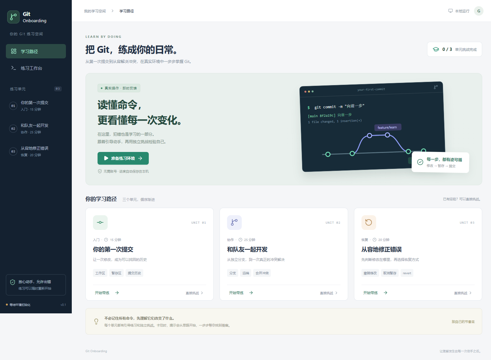
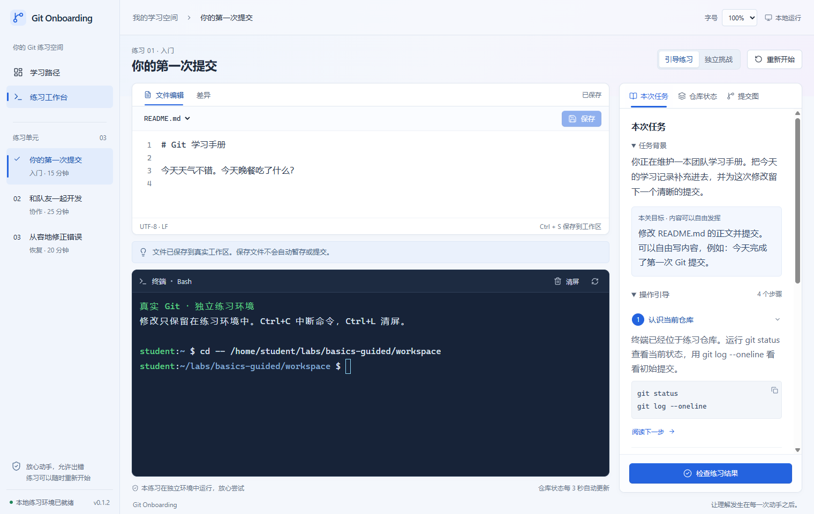

# Git Onboarding

一个面向 Git 新手的中文桌面练习应用。从第一次提交，到分支协作、冲突处理和误操作恢复，在真实 Git 仓库里练习。

**0.2.0-preview.2：系统课程扩展预览版。** 包含 53 个课程、106 个引导/挑战场景。涵盖基础提交与部分暂存、历史整理与恢复、双远端 Fork/PR、推送异常与租约保护、worktree、bisect、子模块、稀疏检出、浅克隆、标签、补丁与离线交付等。课程可以按分类和命令搜索。完整覆盖工作仍在进行，见 [覆盖矩阵与验收记录](docs/scenario-coverage.md)；此预览版提供已完成的课程，不代表全部规划已经完成。

当前发布为 **Windows x64 私有预览版 0.2.0-preview.2**，延续选定的 J 版 Fluent 2 视觉方向。在 [GitHub Release 下载](https://github.com/LX-Cel/git-onboarding/releases/tag/v0.2.0-preview.2)安装包 `Git-Onboarding-0.2.0-preview.2-Setup.exe` 和 SHA256 校验文件；本地构建产物位于 `release/`。项目尚未授予开源许可证；成熟后再决定公开与许可证。

本预览版现有 53 门课程、106 个场景，比 preview.1 新增 PR 合并策略与保护检查，初始化/克隆、pull 策略、merge/am 恢复、分离 HEAD/误删分支、blame/log 定位、跨平台换行、fsck/gc 恢复，以及 SSH 签名、LFS 提交与历史迁移、假凭据历史清理。发布记录会注明每个安装包实际包含的课程。

开发分支现有 62 个单元：61 门判题课程（122 个引导/挑战场景），加上两个独立的自由实验工作区。相较 preview.2，新增认证与权限诊断、入职交接、发布回滚、并发协作、遗留仓库排错和自由实验区；这些新增内容正在进行完整安装包验收。





## 使用

1. 安装 `Git-Onboarding-0.2.0-preview.2-Setup.exe`，打开 Git Onboarding。已有版本先关闭应用，安装到原目录；无需先卸载。打开后按提示「保留练习并更新」，保留现有练习仓库与学习进度。
2. 点击「准备练习环境」。应用验证并导入内置的专用 Linux 镜像；不要求预装 Git 或 Docker。
3. 若尚未安装 WSL，应用请求管理员授权安装系统组件，提示重启后继续。需要支持 WSL 2 的 Windows x64 和已启用的硬件虚拟化。
4. 选择引导练习或直接挑战。文件保存、Git 暂存与 Git 提交是三个不同操作。
5. 进度自动保存在本机。练习仓库会保留；只有确认「重新开始」才重建当前场景。

0.1.1 的入门判题允许自由编写 README 内容，不再要求照抄示例句子。正文、编辑器与终端默认 16px，右上角可选择并保存显示比例。旧环境升级时点击「保留练习并更新」，只替换课程程序，保留练习文件、提交历史和进度。

0.1.2 将工作台改为浅色导航、上方编辑器、下方完整终端和右侧详情面板。右侧切换任务、仓库状态与提交图；手动检查显示本次仓库记录、完成条件和未保存提醒，通过后可以进入独立挑战或下一关。安装到原应用目录即可更新桌面程序；0.1.1 的练习镜像无需重新初始化。任务背景与操作引导可折叠，200% 显示比例时布局重排。

练习环境在初始化完成后不连接外部网络。远端和队友都位于练习环境内，使用真实 Git 仓库；不需要 GitHub 账号。本项目源码的 GitHub 托管与练习远端是两件不同的事。

安装包暂未代码签名，Windows 可能显示未知发布者提示。首次系统组件安装可能需要联网。家庭版、全新未安装 WSL 的机器、企业受限设备和 Windows ARM64 尚未完成实机验收；ARM64 不在此包支持范围内。

## 首版课程

| 单元 | 带练与独立挑战的内容                                                  |
| ---- | --------------------------------------------------------------------- |
| 入门 | 修改文件、查看差异、暂存、提交、查看历史                              |
| 协作 | 功能分支、模拟队友、fetch、真实合并冲突、合并到 main、push 到内置远端 |
| 恢复 | 丢弃指定未暂存修改、取消暂存并保留草稿、revert 修正错误提交           |

每个单元提供任务目标、逐级提示、实际状态判题、工作区/暂存区可视化、真实父子关系提交图。引导步骤可自由阅读；阅读下一步不代表通过，实际仓库状态才决定完成。

## 开发

需要 Windows x64、Node.js 24、npm、Python 3.11+、WSL 2、系统自带的 curl.exe。

```powershell
npm ci
npm run runtime:build
npm run runtime:tools
npm test
npm run test:runtime
npm run build
npm run test:ui
npm start
```

`runtime:build` 从 Alpine 官方 HTTPS 地址获取稳定版元数据并验证 rootfs 的 SHA256，在本次创建的 UUID 发行版中安装 Bash、Git、Python、bubblewrap 等包，导出内置镜像，之后注销本次创建的构建发行版。**不修改现有 Ubuntu 或其他发行版**。构建失败时保留 `.local/runtime-build/owner.json`，方便识别本次构建资源；不要对其他发行版执行清理。

`runtime:tools` 在另一个专用构建发行版中解析 Alpine 官方软件包依赖，下载并验证带签名的 Git LFS、OpenSSH keygen、git-filter-repo 及其依赖，生成离线工具包。成功后注销本次构建发行版，失败时保留 `.local/tools-build/owner.json`。确认先前 apk 进程已退出后，可用 `python scripts/prepare-tools.py --resume` 续建。应用初始化或升级时从安装包离线安装这些工具，保留学生 home；练习环境不向外部网络下载工具。

`npm run dev` 仅提供网页界面预览，明确提示真实终端需要桌面应用；不模拟命令成功。

```powershell
npm run package
```

在 `release/` 生成与 `package.json.version` 对应的安装包；已发布预览版的源码以对应发布标签为准，开发分支会继续变化。打包前会验证镜像和离线工具包 SHA256、课程版本及课程更新包与源文件的一致性，二进制镜像和工具包不写入 Git。安装包内含镜像与工具，不要求用户安装构建工具。

仅修改课程代码时，可用 `npm run runtime:refresh` 更新已校验的本地镜像及课程更新包，无需重新下载 Linux 软件包。跨版本保留数据测试为 `npm run test:upgrade`，需要先将 v0.1.0 发布附件的 `runtime.tar` 放在 `.local/runtime-v0.1.0.tar`。

`test:access` 在隔离环境内用真实 HTTP 认证和 Git 协议验证账号/权限故障。`test:access-lifecycle` 验证终端服务连续启动、关闭和重连后没有遗留进程。升级测试若在升级之前失败，可用 `GIT_ONBOARDING_UPGRADE_TEST_DATA` 指定该次记录的测试数据目录复用旧镜像；该参数只应指向测试目录，不得指向个人练习数据。已完成升级的目录不能再作为 0.1.0 初始样本。

桌面版本使用 `package.json.version`；课程兼容版本使用 `package.json.courseVersion`，并与 `runtime/engine.py` 的 `COURSE_VERSION` 保持一致。仅界面改版不提升课程版本，不重建用户练习。课程代码有变化时同步提升课程版本并刷新镜像，打包会检查版本、哈希和课程源文件一致性。

测试安装后的真实应用（包含空格的路径也支持）：

```powershell
$env:GIT_ONBOARDING_EXECUTABLE = '完整路径\Git Onboarding.exe'
npm run test:ui
Remove-Item Env:\GIT_ONBOARDING_EXECUTABLE
```

图标已包含在仓库中；如需重新生成，运行 `python scripts/make-icon.py`，该可选脚本需要 Pillow。

## 代码结构

```text
src/                 React 界面、xterm.js、提交图布局
desktop/             Electron 主进程、最小 IPC、WSL 生命周期与 PTY 通道
runtime/             课程规格、真实 Git 场景与判题、sandbox、PTY relay
scripts/             镜像构建、镜像验证、真实环境测试
tests/               逻辑测试、Linux 实测、Electron 端到端测试
docs/                产品边界、技术选型、隔离边界、验收记录
resources/           镜像清单与未纳入 Git 的 runtime.tar
```

详情见 [产品与架构](docs/architecture.md)、[隔离边界](docs/isolation.md)、[字体尺度与依据](docs/typography.md)、[验收记录](docs/validation.md)。

## 数据与卸载

Windows 用户数据默认位于 Electron 的应用用户数据目录（通常 `%APPDATA%/git-onboarding`）。其中 `runtime-owner.json` 记录应用自己的发行版和磁盘位置，`progress.json` 保存完成记录。测试数据位于项目 `.local/`。

卸载桌面应用不会擅自注销发行版或删除练习历史。清理时应先备份并核对 `runtime-owner.json`，确认是本应用创建的发行版，再由用户决定删除。不要使用通配符批量注销 WSL 发行版。

## 后续范围

rebase、cherry-pick、reflog 和离线双远端 PR 已包含在当前预览版。尚待实现的 Git 场景以覆盖矩阵为准。云端运行、真实 GitHub 认证与在线 PR、AI 反馈、多平台安装包、自动更新和学习账号不包含在此预览版中。推送源码不会自动生成 Release，发布时需构建、验证并上传安装包。
