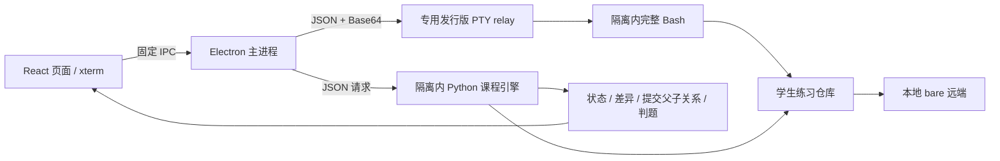

# 产品与架构决策

## 已确认范围

- 覆盖入门、协作容易卡住、异常恢复三类用户，首版各一个完整单元。
- Windows 首发，安装包交付；接受一次性管理员授权、系统组件初始化和按需重启。
- 网页引导、网页文件编辑、完整 Linux Bash、真实 Git，后续扩展云端。
- 先带练再挑战，允许直接挑战；中文、无登录、本地进度、规则反馈。
- 练习远端和队友内置，不连接用户 GitHub；源码存入私有 GitHub 仓库。

## 选择

| 路径                                  | 优点                                                              | 代价与决定                                                     |
| ------------------------------------- | ----------------------------------------------------------------- | -------------------------------------------------------------- |
| Electron + React + WSL 2 + bubblewrap | 成熟的网页桌面交付；xterm 可接真实 PTY；专用 Linux 可复用课程引擎 | 安装包较大，需要 WSL 初始化；本版采用                          |
| Tauri + React + WSL 2                 | 桌面外壳体积较小                                                  | 额外 Rust 工具链和 WebView2 兼容验证；在当前空项目中不优先引入 |
| 本地 HTTP 服务 + 系统浏览器           | 网页开发简单，可为云端提供参考                                    | 还需处理本地端口、认证、Origin 和独立启动器；初版不采用        |

终端传输采用 Windows Node 子进程 → WSL 内 Python PTY relay → bubblewrap 内 Bash。没有命令白名单，不用字符串解析模拟 Git。PTY 支持字符流、尺寸变化、交互编辑器、Ctrl+C、Shell 管道。Windows 不需要编译 node-pty 原生扩展。

## 运行链路

主进程不暴露通用宿主机命令执行或文件读写接口。渲染器开启 sandbox、contextIsolation，关闭 nodeIntegration；校验 IPC 发起页面和主框架，禁止外部导航和新窗口。无本地 HTTP 管理端口。

## 场景与状态

每个 `lesson-mode` 拥有独立的 `workspace`、场景元数据和必要的 `remote.git`、`teammate`。带练与挑战从不同目标构造场景，不共享工作区。重新打开使用现有仓库；重置只删除经过路径校验的当前练习目录。

- 判题检查目标内容是否进入提交、分支和祖先关系、远端实际引用、暂存区和工作区状态。
- 不匹配用户输入的命令字符串；同样的正确结果可通过不同合法路径达成。
- 恢复关刻意保留一个未暂存的草稿，所以「工作区必须干净」不是所有练习的通用标准。
- 恢复关判定反向提交的语义与原历史保留；不会伪称仅凭最终快照就能证明用户一定输入了 `git revert`。
- 每 3 秒刷新状态，终端回车或中断后额外刷新；文件编辑器有未保存内容时不被刷新覆盖。
- 提交图从 `git log --all` 的父提交列表生成，保留真实的分叉和合并边。
- 综合任务同时检查功能交付与必须保留的工作，例如发布标签不改写、队友主线不被覆盖，以及暂存区和工作区的不同草稿版本。
- 自由实验区保留相同的终端、编辑器、仓库状态与提交图，但没有固定判题条件，不写入通关记录，也不计入通关进度的分母。它允许重新初始化自己的仓库，关闭后继续保留状态；重置仍需确认。

## 资料与版本依据

核查日期：2026-09-06。npm 直接依赖和锁文件固定版本；内置 Linux 镜像通过 SHA256 清单固定。

- [Electron 安全清单](https://www.electronjs.org/docs/latest/tutorial/security)
- [Electron 进程沙箱](https://www.electronjs.org/docs/latest/tutorial/sandbox)
- [Microsoft WSL 安装](https://learn.microsoft.com/en-us/windows/wsl/install)
- [Microsoft WSL 配置](https://learn.microsoft.com/en-us/windows/wsl/wsl-config)
- [bubblewrap 官方说明](https://github.com/containers/bubblewrap)
- [Alpine 官方发行源](https://dl-cdn.alpinelinux.org/alpine/latest-stable/releases/x86_64/)
