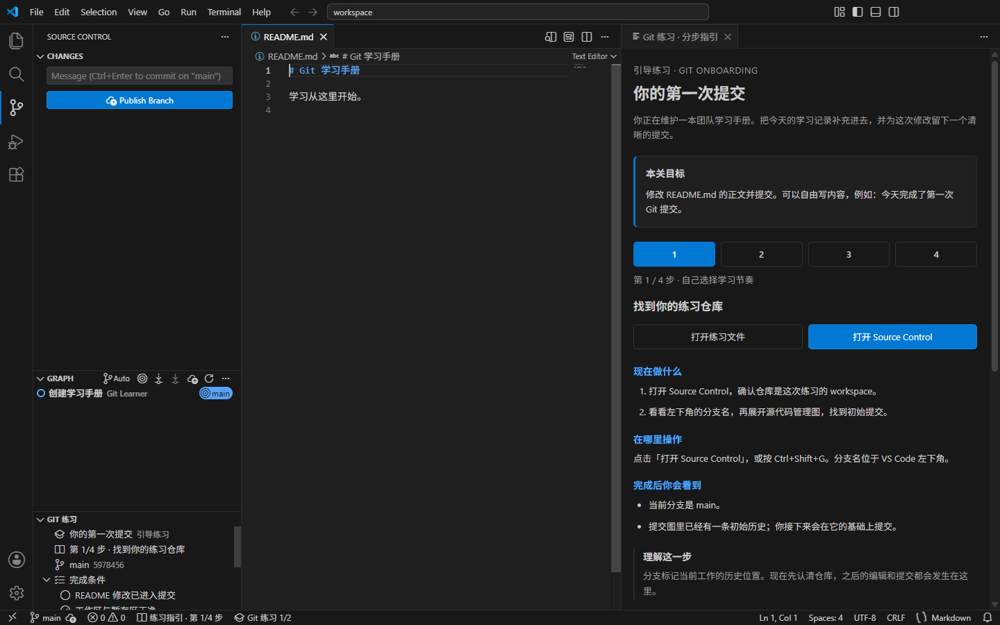

# VS Code 扩展 0.1.1 验收

日期：2026-09-20。平台：Windows x64；真实扩展宿主与安装包界面测试使用独立下载的 VS Code 1.138.0，Git 2.43.0.windows.1，Python 3.11。

## 结果

| 验证                               | 结果                                                             |
| ---------------------------------- | ---------------------------------------------------------------- |
| 原生 Python 引擎，3 课程 × 2 模式  | 0.1.0 已通过 328 项断言，本轮未修改引擎                          |
| 提示、报告、教练面板和扩展生命周期 | 32 项测试通过，含空白指引红灯复现与修复                          |
| 真实 VS Code 扩展宿主              | 11 组场景通过                                                    |
| 打包后的 VSIX 安装与界面           | 安装、自动指引、步骤续接、左右分栏、原生 SCM 暂存/提交、通过报告 |
| 原桌面项目                         | 本轮未改桌面代码；未重跑桌面版完整 WSL 课程矩阵                  |

真实宿主覆盖：内置 Git 扩展的提交、分支创建、fetch、合并冲突、解决后合并与 push，取消暂存与丢弃指定文件；历史 revert 使用真实 Git。未保存内容和仅保存未提交均不会通过，错误时不会复用旧成功结果，历史通关与当前状态区分。两种练习模式独立，重新打开保留历史，当前工作区和其他已打开仓库均可归档重建。

原生引擎额外覆盖中文、空格与单引号路径，CRLF，空提交，全局签名及失败 hooks 的仓库级覆盖，陌生目录与 junction 拒绝，初始化中断恢复，归档文件逐一 SHA-256 验证。Win32 句柄真实禁止 base/workspace 目录删除共享时仍能重置；文件被锁时清晰失败并保留完整备份，解锁后可以恢复。

## 已修正的验收问题

- Windows 中打开的仓库无法直接改名：采用验证完整性的复制归档，并保留工作区目录原位重建。
- 重建期间可能检查到旧通过状态：统一重建入口、检查前后判断重建状态、清空旧报告，并保护未保存编辑。
- 默认终端可能是 WSL 或使用另一套 Git：练习终端使用 Windows PowerShell，优先使用内置 Git 扩展选定的 Git。
- 任务预览随编辑文件切换：任务与报告使用锁定的 Markdown 预览；首次打开主动展开练习视图。

## 0.1.1 引导修复

旧版把指南放进扩展进程的内存 Map，但 `workspaceState.opened` 会跨进程保存。重新打开已使用的练习时，不会重新生成指南，VS Code 恢复虚拟文档后得到空白。通过实际注册的文档 provider 复现，原测试得到空字符串；修复后按当前课程动态生成兼容正文，旧检查报告则明确提示重新检查。

新的分步指引在每次打开练习窗口时自动出现，位于第二编辑组，文件与报告固定在第一组。课程阅读位置保存在工作区状态，翻页只更新阅读位置，不触发 Git 操作或写入通过记录。Source Control 顶部练习条目与底部状态栏都能重新打开指引。

额外回归覆盖：重复轮询不重载未变化的页面、关闭后停止渲染、挑战模式不提前显示解法、非法步骤与未知消息无副作用、HTML 转义和 CSP、未保存/错误/空条件不能显示通过。实际 VSIX 界面测试从命令面板创建练习，点击下一步、打开文件、运行 Reload Window，验证阅读位置和 Git HEAD 保留，再通过原生暂存/提交按钮完成练习。

安装包 UI 还复现了切换步骤时沿用上一页滚动位置的问题：新步骤标题的 viewport ratio 为 0。修复后只在主动导航时，在新页面布局后定位步骤标题；相同 UI 回归转绿，普通状态刷新不会主动滚动。

教练面板采用 [VS Code Webview API](https://code.visualstudio.com/api/extension-guides/webview) 和主题变量；没有引入远程资源或自动执行答案的按钮。

## 复现

```powershell
python -X utf8 tests/native_checks.py
cd vscode-extension
npm ci --ignore-scripts
npm test
# 可选：使用独立、正常可启动的 VS Code 安装；不设置则自动下载稳定版。
$env:VSCODE_EXECUTABLE_PATH = '完整路径\Code.exe'
npm run test:integration
npm run package
# UI smoke 还需要仓库根目录 npm ci 提供 Playwright。
node test/ui-smoke.cjs
```

测试使用独立用户数据、扩展目录与练习仓库。此机器原有 VS Code 安装当时正被更新锁阻止启动，因此使用独立测试副本完成验收，没有修改日常 VS Code 配置。




当前只交付六个基础场景；不把桌面版的全部课程、多平台或 Remote WSL 视为已支持。
