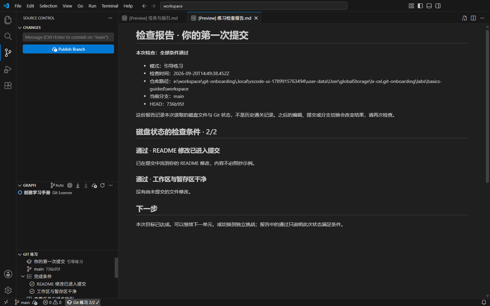

# VS Code 扩展 0.1.0 验收

日期：2026-09-20。平台：Windows x64；真实扩展宿主与安装包界面测试使用独立下载的 VS Code 1.138.0，Git 2.43.0.windows.1，Python 3.11。

## 结果

| 验证 | 结果 |
| --- | --- |
| 原生 Python 引擎，3 课程 × 2 模式 | 328 项断言通过 |
| 提示、报告和扩展生命周期 | 12 项 Node 测试通过 |
| 真实 VS Code 扩展宿主 | 10 组场景通过 |
| 打包后的 VSIX 安装与界面 | 安装、创建新窗口、点击原生 SCM 暂存/提交、通过报告全部通过 |
| 原桌面项目 | 6 项 Node 测试与 Vite 构建通过；未重跑桌面版完整 WSL 课程矩阵 |

真实宿主覆盖：内置 Git 扩展的提交、分支创建、fetch、合并冲突、解决后合并与 push，取消暂存与丢弃指定文件；历史 revert 使用真实 Git。未保存内容和仅保存未提交均不会通过，错误时不会复用旧成功结果，历史通关与当前状态区分。两种练习模式独立，重新打开保留历史，当前工作区和其他已打开仓库均可归档重建。

原生引擎额外覆盖中文、空格与单引号路径，CRLF，空提交，全局签名及失败 hooks 的仓库级覆盖，陌生目录与 junction 拒绝，初始化中断恢复，归档文件逐一 SHA-256 验证。Win32 句柄真实禁止 base/workspace 目录删除共享时仍能重置；文件被锁时清晰失败并保留完整备份，解锁后可以恢复。

## 已修正的验收问题

- Windows 中打开的仓库无法直接改名：采用验证完整性的复制归档，并保留工作区目录原位重建。
- 重建期间可能检查到旧通过状态：统一重建入口、检查前后判断重建状态、清空旧报告，并保护未保存编辑。
- 默认终端可能是 WSL 或使用另一套 Git：练习终端使用 Windows PowerShell，优先使用内置 Git 扩展选定的 Git。
- 任务预览随编辑文件切换：任务与报告使用锁定的 Markdown 预览；首次打开主动展开练习视图。

## 复现

```powershell
python -X utf8 tests/native_checks.py
cd vscode-extension
npm ci --ignore-scripts
npm test
# 可选：使用独立、正常可启动的 VS Code 安装；不设置则自动下载稳定版。
$env:VSCODE_EXECUTABLE_PATH = '完整路径\Code.exe'
npm run test:integration
npm run package
# UI smoke 还需要仓库根目录 npm ci 提供 Playwright。
node test/ui-smoke.cjs
```

测试使用独立用户数据、扩展目录与练习仓库。此机器原有 VS Code 安装当时正被更新锁阻止启动，因此使用独立测试副本完成验收，没有修改日常 VS Code 配置。



当前只交付六个基础场景；不把桌面版的全部课程、多平台或 Remote WSL 视为已支持。
